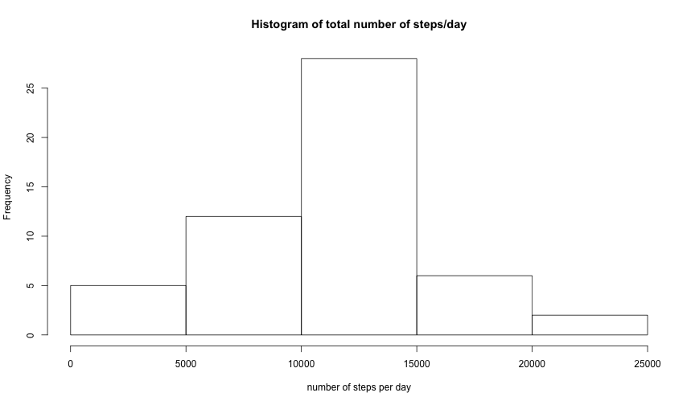

```r
        library(knitr)        
        opts_chunk$set(echo=TRUE,fig.width=12)
```

#Loading and preprocessing the data
1. Code below will load the Activity data from activity.csv (assumes that it was previously downloaded and unzipped into working directory)

```r
        data<-read.csv("activity.csv",stringsAsFactors=FALSE)
```

#What is mean total number of steps taken per day?
1.Calculating the total number of steps taken per day:

```r
        a<-aggregate(data$steps,by=list(data$date),FUN="sum")
        colnames(a)<-c("date","steps")
```
2. Creating a histogram of the total number of steps taken each day

```r
hist(a$steps,
     main="Histogram of total number of steps/day",
     xlab="number of steps per day")
```

 
3. Calculating and reporting the mean and median of the total number of steps 
taken per day

```r
        mean<-mean(a$steps,na.rm=TRUE)
        median<-median(a$steps,na.rm=TRUE)
        paste("Mean is",round(mean,2), sep=" ")
```

```
## [1] "Mean is 10766.19"
```

```r
        paste("Median is", median, sep=" ")
```

```
## [1] "Median is 10765"
```
#What is the average daily activity pattern?

1. Making a time series plot (i.e. type = "l") of the 5-minute interval (x-axis) 
and the average number of steps taken, averaged across all days (y-axis)

```r
        b<-aggregate(data$steps,by=list(data$interval),FUN="mean",na.rm=TRUE)
        colnames(b)<-c("interval","steps")
        plot(b$interval,b$steps,type="l", main="Average number of steps per 
             interval",xlab="interval", ylab="steps per interval")
```

 
2. Which 5-minute interval, on average across all the days in the dataset, 
contains the maximum number of steps?

```r
        i<-b[which.max(b$steps),1]
        paste(i,"interval contains maximum number of steps",sep=" ")
```

```
## [1] "835 interval contains maximum number of steps"
```

#Imputing missing values

1. Calculating and reporting the total number of missing values in the dataset 
(i.e. the total number of rows with NAs)

```r
        nas<-sum(is.na(data$steps))
        paste(nas,"rows have missing values",sep=" ")
```

```
## [1] "2304 rows have missing values"
```

2. Devise a strategy for filling in all of the missing values in the dataset:
using the mean for the same 5-minute interval

3. Create a new dataset that is equal to the original dataset but with the 
missing data filled in.

```r
        dataset<-data
        for (i in 1:nrow(dataset)) {
                if (is.na(dataset$steps[i])) {
                dataset$steps[i]<-b[which(dataset$interval[i]==b$interval),2]
                }
        }
        nasnew<-sum(is.na(dataset$steps))
        paste(nasnew, "NA's in new dataset", sep=" ")
```

```
## [1] "0 NA's in new dataset"
```


4. Making a histogram of the total number of steps taken each day:

```r
        anew<-aggregate(dataset$steps,by=list(dataset$date),FUN="sum")
        colnames(anew)<-c("date","steps")
                hist(anew$steps,
                     main="Histogram of total number of steps/day",
                     xlab="number of steps per day")
```

 
Calculating the mean and median total number of steps taken per day: 

```r
        meannew<-mean(anew$steps,na.rm=TRUE)
        mediannew<-median(anew$steps,na.rm=TRUE)
        paste("Mean is", round(meannew,2), sep=" ")
```

```
## [1] "Mean is 10766.19"
```

```r
        paste("Median is", round(mediannew,2), sep=" ")
```

```
## [1] "Median is 10766.19"
```
Do these values differ from the estimates from the first part of the assignment? 

```r
        paste("The difference between new Mean and old Mean is", 
              meannew-mean, sep=" ")
```

```
## [1] "The difference between new Mean and old Mean is 0"
```

```r
        paste("The difference between new Median and old Median is", 
              mediannew-median, sep=" ")
```

```
## [1] "The difference between new Median and old Median is 1.1886792452824"
```
The impact of imputing missing data on the estimates of the total daily number of 
steps is that Mean remained unchanged while Median increased. 

#Are there differences in activity patterns between weekdays and weekends?

1. Creating a new factor variable in the dataset with two levels – “weekday” and 
“weekend” indicating whether a given date is a weekday or weekend day.

```r
        dataset$date<-as.Date(dataset$date)
        dataset$day<-as.factor(weekdays(dataset$date))
        levels(dataset$day)<-list(weekday=c("Monday","Tuesday","Wednesday",
        "Thursday","Friday"),weekend=c("Saturday","Sunday"))
```

2. Making a panel plot containing a time series plot (i.e. type = "l") of the 
5-minute interval (x-axis) and the average number of steps taken, averaged 
across all weekday days or weekend days (y-axis) with lattice package


```r
        c<-aggregate(dataset$steps,by=list(dataset$interval,dataset$day),
                     FUN="mean")
        colnames(c)<-c("interval","day","steps")
        library(lattice)
        xyplot(steps ~ interval| day, 
           data = c,
           type = "l",
           xlab = "Interval",
           ylab = "Number of steps per interval",
           layout=c(1,2))
```

 
